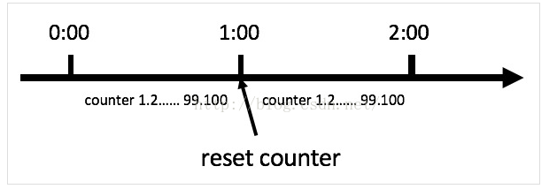

#网关限流介绍及实现
网关可以做很多的事情，比如，限流，当我们的系统被频繁的请求的时候，就有可能 将系统压垮，所以 为了解决这个问题，需要在每一个微服务中做限流操作，但是如果有了网关，那么就可以在网关系统做限流，因为所有的请求都需要先通过网关系统才能路由到微服务中。

###计数算法

它是限流算法中最简单最容易的一种算法，比如我们要求某一个接口，1分钟内的请求不能超过10次，我们可以在开始时设置一个计数器，每次请求，该计数器+1；如果该计数器的值大于10并且与第一次请求的时间间隔在1分钟内，那么说明请求过多；如果该请求与第一次请求的时间间隔大于1分钟，并且该计数器的值还在限流范围内，那么重置该计数器。

不过，计数算法有致命问题，当遇到恶意请求，在0:59时，瞬间请求100次，并且在1:00请求100次，那么这个用户在1秒内请求了200次，用户可以在重置节点突发请求，而瞬间超过我们设置的速率限制，用户可能通过算法漏洞击垮我们的应用。如下图，如何解决呢，看下边的滑动窗口算法。

###滑动窗口算法

在上图中，整个红色矩形框是一个时间窗口，在我们的例子中，一个时间窗口就是1分钟，然后我们将时间窗口进行划分，如上图我们把滑动窗口划分为6格，所以每一格代表10秒，每超过10秒，我们的时间窗口就会向右滑动一格，每一格都有自己独立的计数器，例如：一个请求在0:35到达，那么0:30到0:39的计数器会+1，那么滑动窗口是怎么解决临界点的问题呢？如上图，0:59到达的100个请求会在灰色区域格子中，而1：00到达的请求会在红色格子中，窗口会向右滑动一格，那么此时间窗口内的总请求数共200个，超过了限定的100，所以此时能够检测出来触发了限流。回头看看计数器算法，会发现，其实计数器算法就是窗口滑动算法，只不过计数器算法没有对时间窗口进行划分，所以是一格。由此可见，当滑动窗口的格子划分越多，限流的统计就会越精确。

###令牌桶算法

令牌桶算法是比较常见的限流算法之一，大概描述如下：

1）假如用户配置的平均发送速率为r，则每隔1/r秒一个令牌被加入到桶中；

2）假设桶最多可以存发b个令牌。如果令牌到达时令牌桶已经满了，那么这个令牌会被丢弃；

3）当一个n个字节的数据包到达时，就从令牌桶中删除n个令牌，并且数据包被发送到网络；

4）如果令牌桶中少于n个令牌，那么不会删除令牌，并且认为这个数据包在流量限制之外；

5）算法允许最长b个字节的突发，但从长期运行结果看，数据包的速率被限制成常量r。对于在流量限制外的数据包可以以不同的方式处理：

　　它们可以被丢弃；

　　它们可以排放在队列中以便当令牌桶中累积了足够多的令牌时再传输；

　　它们可以继续发送，但需要做特殊标记，网络过载的时候将这些特殊标记的包丢弃。

如下图：

### 漏桶算法
 
 漏桶算法思路很简单，水（请求）先进入到漏桶里，漏桶以一定的速度出水，当水流入速度过大会直接溢出，可以看出漏桶算法能强行限制数据的传输速率。
 
 漏桶算法示意图：
 
 
 
 在某些情况下，漏桶算法不能够有效地使用网络资源。因为漏桶的漏出速率是固定的参数，所以即使网络中不存在资源冲突（没有发生拥塞），漏桶算法也不能使某一个单独的流突发到端口速率。因此，漏桶算法对于存在突发特性的流量来说缺乏效率。而令牌桶算法则能够满足这些具有突发特性的流量。通常，漏桶算法与令牌桶算法可以结合起来为网络流量提供更大的控制