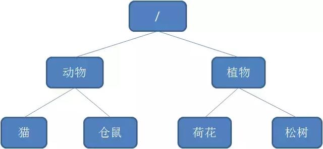
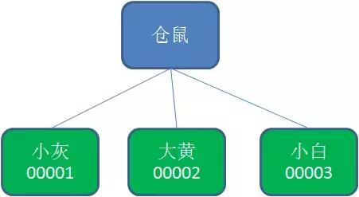
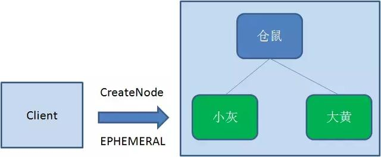
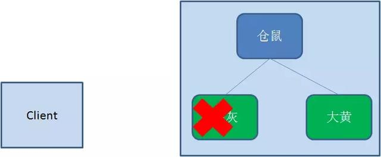
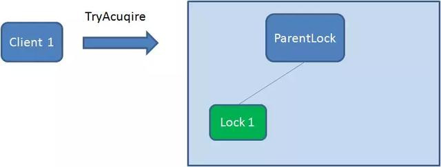
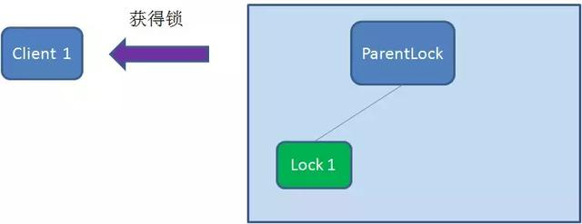
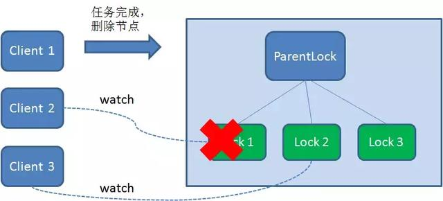
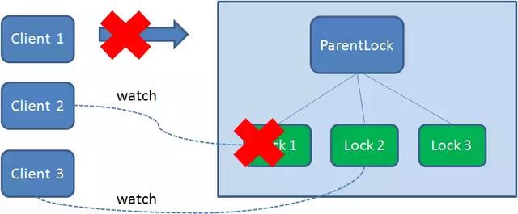
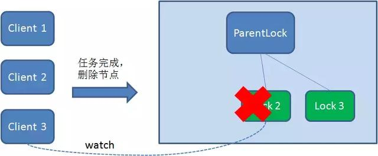
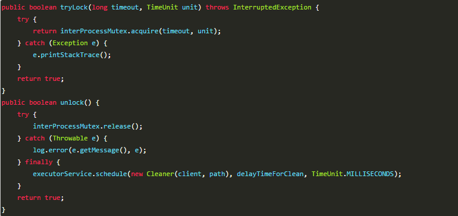

#三种实现分布式锁的方式

### 一、为什么要使用分布式锁

我们在开发应用的时候，如果需要对某一个共享变量进行多线程同步访问的时候，可以使用我们学到的Java多线程的18般武艺进行处理，并且可以完美的运行，毫无Bug！

注意这是单机应用，也就是所有的请求都会分配到当前服务器的JVM内部，然后映射为操作系统的线程进行处理！而这个共享变量只是在这个JVM内部的一块内存空间！

后来业务发展，需要做集群，一个应用需要部署到几台机器上然后做负载均衡，大致如下图：


上图可以看到，变量A存在JVM1、JVM2、JVM3三个JVM内存中（这个变量A主要体现是在一个类中的一个成员变量，是一个有状态的对象，例如：UserController控制器中的一个整形类型的成员变量），如果不加任何控制的话，变量A同时都会在JVM分配一块内存，三个请求发过来同时对这个变量操作，显然结果是不对的！即使不是同时发过来，三个请求分别操作三个不同JVM内存区域的数据，变量A之间不存在共享，也不具有可见性，处理的结果也是不对的！

如果我们业务中确实存在这个场景的话，我们就需要一种方法解决这个问题！

为了保证一个方法或属性在高并发情况下的同一时间只能被同一个线程执行，在传统单体应用单机部署的情况下，可以使用Java并发处理相关的API(如ReentrantLock或Synchronized)进行互斥控制。在单机环境中，Java中提供了很多并发处理相关的API。但是，随着业务发展的需要，原单体单机部署的系统被演化成分布式集群系统后，由于分布式系统多线程、多进程并且分布在不同机器上，这将使原单机部署情况下的并发控制锁策略失效，单纯的Java API并不能提供分布式锁的能力。为了解决这个问题就需要一种跨JVM的互斥机制来控制共享资源的访问，这就是分布式锁要解决的问题！

### 二、分布式锁应该具备哪些条件
在分析分布式锁的三种实现方式之前，先了解一下分布式锁应该具备哪些条件：

- 1、在分布式系统环境下，一个方法在同一时间只能被一个机器的一个线程执行； 
- 2、高可用的获取锁与释放锁； 
- 3、高性能的获取锁与释放锁； 
- 4、具备可重入特性； 
- 5、具备锁失效机制，防止死锁； 
- 6、具备非阻塞锁特性，即没有获取到锁将直接返回获取锁失败。

### 三、分布式锁的三种实现方式

目前几乎很多大型网站及应用都是分布式部署的，分布式场景中的数据一致性问题一直是一个比较重要的话题。分布式的CAP理论告诉我们“任何一个分布式系统都无法同时满足一致性（Consistency）、可用性（Availability）和分区容错性（Partition tolerance），最多只能同时满足两项。”所以，很多系统在设计之初就要对这三者做出取舍。在互联网领域的绝大多数的场景中，都需要牺牲强一致性来换取系统的高可用性，系统往往只需要保证“最终一致性”，只要这个最终时间是在用户可以接受的范围内即可。

在很多场景中，我们为了保证数据的最终一致性，需要很多的技术方案来支持，比如分布式事务、分布式锁等。有的时候，我们需要保证一个方法在同一时间内只能被同一个线程执行。

- 基于数据库实现分布式锁； 
- 基于缓存（Redis等）实现分布式锁； 
- 基于Zookeeper实现分布式锁；

##### 1.基于数据库实现排他锁

方案1

表结构
```sql
CREATE TABLE `method_lock` (
  `id` int(11) unsigned NOT NULL AUTO_INCREMENT COMMENT '主键',
  `method_name` varchar(64) NOT NULL COMMENT '锁定的方法名',
  `desc` varchar(1024) NOT NULL COMMENT '备注信息',
  `update_time` timestamp NOT NULL DEFAULT CURRENT_TIMESTAMP ON UPDATE CURRENT_TIMESTAMP,
  PRIMARY KEY (`id`),
  UNIQUE KEY `uidx_method_name` (`method_name`) USING BTREE
) ENGINE=InnoDB AUTO_INCREMENT=1 DEFAULT CHARSET=utf8 COMMENT='锁定中的方法';
```
获取锁

```sql
INSERT INTO method_lock (method_name, desc) VALUES ('methodName', 'methodName');
```
对method_name做了唯一性约束，这里如果有多个请求同时提交到数据库的话，数据库会保证只有一个操作可以成功。

方案2

表结构

```sql
DROP TABLE IF EXISTS `method_lock`;
CREATE TABLE `method_lock` (
  `id` int(11) unsigned NOT NULL AUTO_INCREMENT COMMENT '主键',
  `method_name` varchar(64) NOT NULL COMMENT '锁定的方法名',
  `state` tinyint NOT NULL COMMENT '1:未分配；2：已分配',
  `update_time` timestamp NOT NULL DEFAULT CURRENT_TIMESTAMP ON UPDATE CURRENT_TIMESTAMP,
  `version` int NOT NULL COMMENT '版本号',
  PRIMARY KEY (`id`),
  UNIQUE KEY `uidx_method_name` (`method_name`) USING BTREE
) ENGINE=InnoDB AUTO_INCREMENT=3 DEFAULT CHARSET=utf8 COMMENT='锁定中的方法';
```

先获取锁的信息

```sql
select id, method_name, state,version from method_lock where state=1 and method_name='methodName';
```

占有锁

```sql
update t_resoure set state=2, version=2, update_time=now() where method_name='methodName' and state=1 and version=2;
```

如果没有更新影响到一行数据，则说明这个资源已经被别人占位了。

缺点：

- 1、这把锁强依赖数据库的可用性，数据库是一个单点，一旦数据库挂掉，会导致业务系统不可用。
- 2、这把锁没有失效时间，一旦解锁操作失败，就会导致锁记录一直在数据库中，其他线程无法再获得到锁。
- 3、这把锁只能是非阻塞的，因为数据的insert操作，一旦插入失败就会直接报错。没有获得锁的线程并不会进入排队队列，要想再次获得锁就要再次触发获得锁操作。
- 4、这把锁是非重入的，同一个线程在没有释放锁之前无法再次获得该锁。因为数据中数据已经存在了。

解决方案：
- 1、数据库是单点？搞两个数据库，数据之前双向同步。一旦挂掉快速切换到备库上。
- 2、没有失效时间？只要做一个定时任务，每隔一定时间把数据库中的超时数据清理一遍。
- 3、非阻塞的？搞一个while循环，直到insert成功再返回成功。
- 4、非重入的？在数据库表中加个字段，记录当前获得锁的机器的主机信息和线程信息，那么下次再获取锁的时候先查询数据库，如果当前机器的主机信息和线程信息在数据库可以查到的话，直接把锁分配给他就可以了。

#####2.基于redis实现

```redis
SET resource_name my_random_value NX PX 30000
```

方案：

```java
try{
	lock = redisTemplate.opsForValue().setIfAbsent(lockKey, LOCK);
	logger.info("cancelCouponCode是否获取到锁："+lock);
	if (lock) {
		// TODO
		redisTemplate.expire(lockKey,1, TimeUnit.MINUTES); //成功设置过期时间
		return res;
	}else {
		logger.info("cancelCouponCode没有获取到锁，不执行任务!");
	}
}finally{
	if(lock){	
		redisTemplate.delete(lockKey);
		logger.info("cancelCouponCode任务结束，释放锁!");		
	}else{
		logger.info("cancelCouponCode没有获取到锁，无需释放锁!");
	}
}

```

缺点：

- 在这种场景（主从结构）中存在明显的竞态:
- 客户端A从master获取到锁，
- 在master将锁同步到slave之前，master宕掉了。
- slave节点被晋级为master节点，
- 客户端B取得了同一个资源被客户端A已经获取到的另外一个锁。安全失效！


##### 3.基于zookeeper实现

让我们来回顾一下Zookeeper节点的概念：




Zookeeper的数据存储结构就像一棵树，这棵树由节点组成，这种节点叫做Znode。

Znode分为四种类型：

1.持久节点 （PERSISTENT）

默认的节点类型。创建节点的客户端与zookeeper断开连接后，该节点依旧存在 。

2.持久节点顺序节点（PERSISTENT_SEQUENTIAL）

所谓顺序节点，就是在创建节点时，Zookeeper根据创建的时间顺序给该节点名称进行编号：



3.临时节点（EPHEMERAL）





4.临时顺序节点（EPHEMERAL_SEQUENTIAL）

顾名思义，临时顺序节点结合和临时节点和顺序节点的特点：在创建节点时，Zookeeper根据创建的时间顺序给该节点名称进行编号；当创建节点的客户端与zookeeper断开连接后，临时节点会被删除。

Zookeeper分布式锁的原理

Zookeeper分布式锁恰恰应用了临时顺序节点。具体如何实现呢？让我们来看一看详细步骤：

获取锁


首先，在Zookeeper当中创建一个持久节点ParentLock。当第一个客户端想要获得锁时，需要在ParentLock这个节点下面创建一个临时顺序节点 Lock1。



之后，Client1查找ParentLock下面所有的临时顺序节点并排序，判断自己所创建的节点Lock1是不是顺序最靠前的一个。如果是第一个节点，则成功获得锁。



这时候，如果再有一个客户端 Client2 前来获取锁，则在ParentLock下载再创建一个临时顺序节点Lock2。


Client2查找ParentLock下面所有的临时顺序节点并排序，判断自己所创建的节点Lock2是不是顺序最靠前的一个，结果发现节点Lock2并不是最小的。

于是，Client2向排序仅比它靠前的节点Lock1注册Watcher，用于监听Lock1节点是否存在。这意味着Client2抢锁失败，进入了等待状态。


这时候，如果又有一个客户端Client3前来获取锁，则在ParentLock下载再创建一个临时顺序节点Lock3。


Client3查找ParentLock下面所有的临时顺序节点并排序，判断自己所创建的节点Lock3是不是顺序最靠前的一个，结果同样发现节点Lock3并不是最小的。

于是，Client3向排序仅比它靠前的节点Lock2注册Watcher，用于监听Lock2节点是否存在。这意味着Client3同样抢锁失败，进入了等待状态。


释放锁

释放锁分为两种情况：

1.任务完成，客户端显示释放

当任务完成时，Client1会显示调用删除节点Lock1的指令



2.任务执行过程中，客户端崩溃

获得锁的Client1在任务执行过程中，如果Duang的一声崩溃，则会断开与Zookeeper服务端的链接。根据临时节点的特性，相关联的节点Lock1会随之自动删除。



由于Client2一直监听着Lock1的存在状态，当Lock1节点被删除，Client2会立刻收到通知。这时候Client2会再次查询ParentLock下面的所有节点，确认自己创建的节点Lock2是不是目前最小的节点。如果是最小，则Client2顺理成章获得了锁。


同理，如果Client2也因为任务完成或者节点崩溃而删除了节点Lock2，那么Client3就会接到通知。



最终，Client3成功得到了锁。

方案：

可以直接使用zookeeper第三方库Curator客户端，这个客户端中封装了一个可重入的锁服务。



Curator提供的InterProcessMutex是分布式锁的实现。acquire方法用户获取锁，release方法用于释放锁。

    https://github.com/apache/curator/

缺点：

    性能上可能并没有缓存服务那么高。因为每次在创建锁和释放锁的过程中，都要动态创建、销毁瞬时节点来实现锁功能。ZK中创建和删除节点只能通过Leader服务器来执行，然后将数据同不到所有的Follower机器上。

    其实，使用Zookeeper也有可能带来并发问题，只是并不常见而已。考虑这样的情况，由于网络抖动，客户端可ZK集群的session连接断了，那么zk以为客户端挂了，就会删除临时节点，这时候其他客户端就可以获取到分布式锁了。就可能产生并发问题。这个问题不常见是因为zk有重试机制，一旦zk集群检测不到客户端的心跳，就会重试，Curator客户端支持多种重试策略。多次重试之后还不行的话才会删除临时节点。（所以，选择一个合适的重试策略也比较重要，要在锁的粒度和并发之间找一个平衡。）

### 4.总结

下面的表格总结了Zookeeper和Redis分布式锁的优缺点：


三种方案的比较

上面几种方式，哪种方式都无法做到完美。就像CAP一样，在复杂性、可靠性、性能等方面无法同时满足，所以，根据不同的应用场景选择最适合自己的才是王道。

- 从理解的难易程度角度（从低到高）

    数据库 > 缓存 > Zookeeper

- 从实现的复杂性角度（从低到高）

    Zookeeper >= 缓存 > 数据库

- 从性能角度（从高到低）

    缓存 > Zookeeper >= 数据库

- 从可靠性角度（从高到低）

    Zookeeper > 缓存 > 数据库

