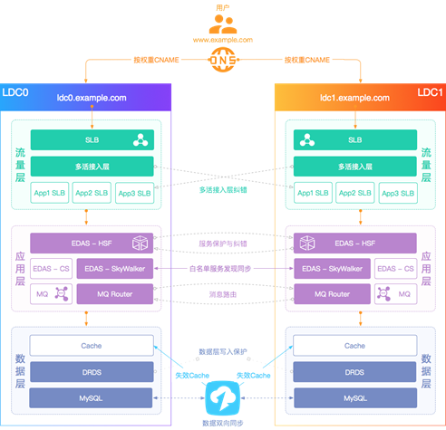
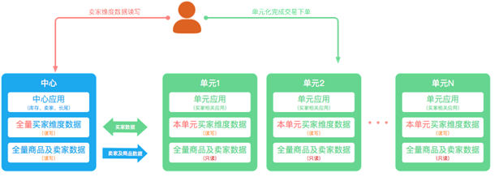
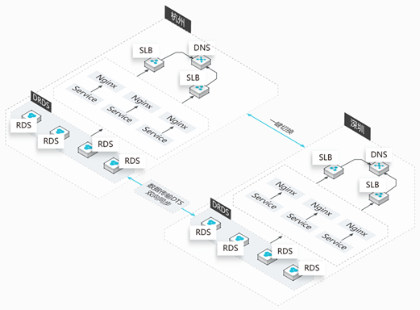
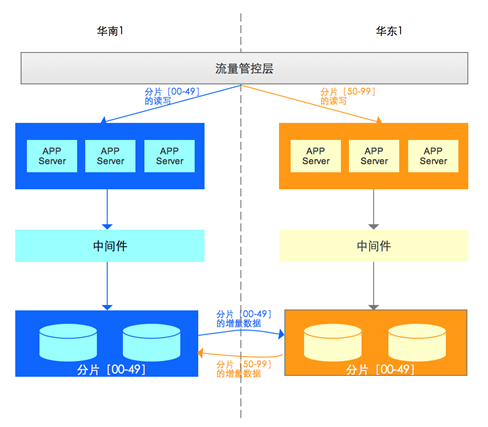
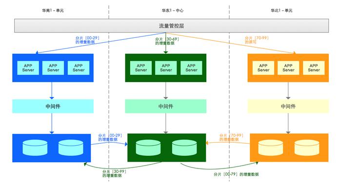
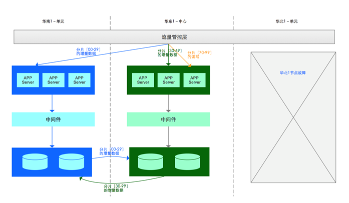
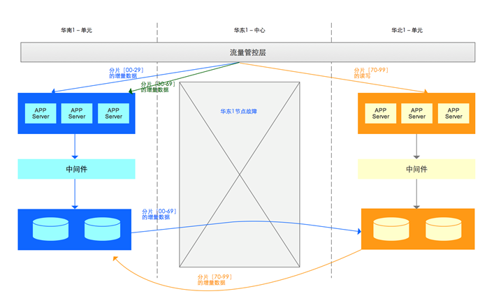

#数据库异地多活解决方案

###行业背景

异地多活指分布在异地的多个站点同时对外提供服务的业务场景。异地多活是高可用架构设计的一种，与传统的灾备设计的最主要区别在于“多活”，即所有站点都是同时在对外提供服务的。

以一个简单的业务单元的IT系统为例，整个IT系统的异地多活方案如下图所示。

整个方案将各站点分为：分流量层、应用层和数据层。

本文聚焦数据层的异地多活解决方案。目前针对数据层设计异地多活解决方案时，需遵循以下几个原则：

##### 单元封闭：

应用要走向异地，首先要面对的便是物理距离带来的延时。如果某个应用请求需要在异地多个单元对同一行记录进行修改，为满足异地单元间数据库数据的一致性和完整性，我们需要付出高昂的时间成本。此外，如果某个应用请求需要多次访问异地单元，且各单元间服务再被服务调用，那物理延时将无法预估。因此，数据库异地多活的问题转移到了如何避免跨单元的问题，即要做到单元内数据读写封闭，不能出现不同单元对同一行数据进行修改，所以我们需要找到一个维度去划分单元，避免数据写冲突。

##### 数据拆分：

选择什么维度来解决单点写的问题，要从业务本身入手去分析。例如电商的业务，最重要的流程即下单交易流程，从下单业务对数据划分单元时，改造成本最低、用户体验相对好的便是买家维度，即通过买家ID进行下单业务拆分，如下图所示。

买家的下单操作在买家所在的本单元内即可完成读写封闭。按照上述示例划分业务，就意味着非买家维度的就需要做一定的妥协。对于非买家维度的操作，比如卖家操作（例如商品数据的修改）就可能会跨单元，对于买家与卖家数据读一致的问题， 可以接受“最终一致”的就通过读写分离的方案， 不能接受“最终一致”的则需要跨单元访问。

##### 数据同步：

将业务划分多个单元以后，对于数据库来说，面临的最大挑战就是数据同步，因为对于单元封闭的买家维度的数据（unit类型）需要把单元的数据全部同步到中心，对于读写分离类型的(copy类型)，我们要把中心的数据同步到单元。

原生的数据库复制无法满足单元化复杂的同步需求（例如，只同步部分的数据、库表的过滤、双向循环、API服务化等定制化的需求 ），在普通业务逻辑场景下，DTS的同步性能更高效、更稳定，DTS也成为多活的基础设施。具体的数据同步如下图所示。

##### 缓存失效

实现数据层异地多活后，业务希望实时获取数据库变更消息，单元的缓存失效实现可通过数据订阅实现。通过数据订阅提供的消费 SDK，业务层可订阅 RDS 增量数据然后触发更新单元的缓存，通过这样的方式，应用无需实现缓存更新逻辑，架构更加简单。

### 核心产品

阿里云数据库异地多活解决方案使用以下阿里云核心产品，按照架构设计原则提供数据层多活解决方案。

DRDS

按照之前说的业务数据拆分的维度，阿里云DRDS有两种集群分别支持买家维度与卖家维度：

unit 模式的DRDS集群：多地用户分别在本地域读写本地域的数据，且本地域的数据会和中心数据做双向同步。
copy 模式的DRDS集群：此集群数据在中心数据库写，完成后全量同步到各个单元。需要注意的是，DRDS层面需要增加对数据写入路由的判断：如果是跨单元的写，则判断为非法操作并抛出异常，确保数据不会跨单元写。

更多DRDS的介绍请参考[分布式关系型数据库DRDS](https://help.aliyun.com/product/29657.html)一文。

DTS

数据复制是数据库多活设计关键的一环，其中数据复制的正确性是第一位，同时效率也很关键。阿里云DTS支持多重的check ，避免循环复制（用事务表，或者thread_id方案）， 采用并行复制（串行的分发，冲突检测，并行的执行）、大事务切割来保证最终一致性。

数据校验也是关键的一环，阿里云DTS 通过全量校验工具（TCP）和增量校验工具（AMG）来保证实时/定时检查中心和单元的数据准确性，确保线上数据的万无一失。

更多的数据传输相关内容请参考[数据传输服务](https://help.aliyun.com/product/26590.html)一文

HDM

阿里云HDM提供了DRDS集群的搭建、同步链路的创建、多活的数据库监控、数据校验、集群扩缩容以及自动化的容灾等服务，都可通过HDM完成，通过HDM实现了异地多活场景下数据库的管理。

更多的数据管理请参考[混合云数据库管理](https://help.aliyun.com/product/63907.html)一文。

### 典型应用场景

##### 两地容灾切换方案

容灾是异地多活中最核心的一环， 以两个城市异地多活部署架构图为例：

在两个城市（城市1位于华南1地域、城市2位于华东1地域）均部署一套完整的业务系统。

下单业务按照“user_id”％ 100 进行分片，在正常情况下：

[00~49]分片所有的读写都在城市1的数据库实例主库。

[50～99]分片所有的读写都在城市2的数据库实例主库。

“城市1的数据库实例主库”和 “城市2的数据库实例主库”建立DTS双向复制

当出现异常时，需要进行容灾切换。可能出现的场景有以下4种：

|序号|	异常情况	|操作|
| :----: | :----|:----|
|1|	城市1数据库主库故障	|1、数据库引擎完成主备切换； 2、DTS自动切换到城市1新主库读取新的增量更新，然后同步到城市2的数据库实例|
|2|	城市1所有APP Server故障	|有两种处理方案： 方案1：数据库层无任何操作，APP Server切换到城市2，并跨城市读写城市1的数据库； 方案2：APP Server和数据库都切换到城市2|
|3|	城市1所有数据库故障	|有两种处理方案： 方案1：数据库层切换到城市2，APP Server跨城市读写城市2的数据库； 方案2：APP Server和数据库都切换到城市2|
|4|	城市1整体故障（包括所有APP Server ＋数据库等）|1、城市1的全部数库流量切换到城市2； 2、城市1数据库到城市2数据库的DTS数据同步链路停止 3、在城市2中，DTS启动，保存［00-49］分片的变更 4、城市1故障恢复后，［00-49］的增量数据同步到城市1的数据库实例。 5、同步结束后，将［00-49］的数据库流量从城市2切回到城市1启动［00-49］分片从城市1到城市2的DTS同步|

将第2种、第3种异常情况，全部采用第2种方案进行处理，那么不管是所有的APP Server异常、所有的数据库异常、整个城市异常，就直接按照城市级容灾方案处理，直接将APP Server、数据库切换到到另一个城市。

##### 多城异地多活

多城市异地多活模式指的是3个或者3个以上城市间部署异地多活。该模式下存在中心节点和单元节点：

- 中心节点：指单元节点的增量数据都需要实时的同步到中心节点，同时中心节点将所有分片的增量数据同步到其他单元节点。
- 单元节点：即对应分片读写的节点，该节点需要将该分片的增量同步到中心节点，并且接收来自于中心节点的其他分片的增量数据。

下图是3城市异地多活架构图，其中华东1就是中心节点，华南1和华北1是单元节点

##### 单元城市级故障

当单元城市出现故障，业务需要切换时，以华南1城市级故障为例：

1、容灾

- 华南1（单元）的全部数库流量切换到华东1（中心）；
- 华南1（单元）数据库到华东1（中心）数据库的DTS数据同步链路停止，并记录同步位点
- 分片［00-29］的读写切换到华东1（中心）

2、恢复
- 重建华南1（单元）；
- 华南1（单元）数据迁移和同步完成后，停止分片［00-29］在华东1（中心）的读写；
- 停止华东1（中心）到华南1（单元）分片［00-29］的数据同步；
- 创建华南1（单元）到华东1（中心）的数据同步；
- 将分片［00-29］的读写切换到华南1（单元）；
- 华南1（单元）的数据库主库开启写入；
- 检查；

中心城市级故障

当中心城市出现故障，业务需要切换时，以华东1城市级故障为例：

1、容灾

- 华东1（中心）的全部数库流量切换到华南1（单元）；
- 华东1（中心）数据库到华南1（单元）数据库的DTS数据同步链路停止；
- 华东1（中心）数据库到华北1（单元）数据库的DTS数据同步链路停止；
- 华南1（单元）数据库到华东1（中心）数据库的DTS数据同步链路停止；
- 华北1（单元）数据库到华东1（中心）数据库的DTS数据同步链路停止；
- 新增华南1（单元）数据库到华北1（单元）分片［30～99］的DTS数据同步链路；

2、恢复

- 重建华东1（中心）；
- 华东1（中心）数据迁移和同步完成后，停止分片［30-69］在华南1（单元）的读写；
- 停止华东1（中心）到华南1（单元）分片［00-29］的数据同步；
- 创建华东1（中心）到华南1（单元）的数据同步；
- 创建华东1（中心）到华北1（单元）的数据同步；
- 将分片［00-29］的读写切换到华南1（单元）；
- 华南1（单元）的数据库主库开启写入；
- 检查；

