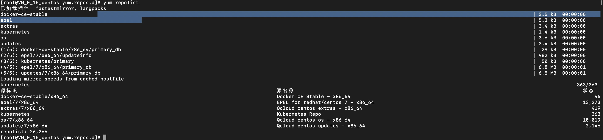
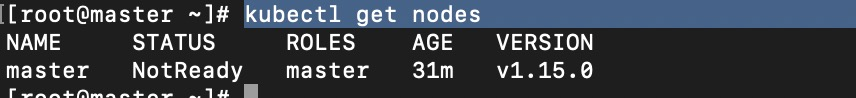

#k8s 通过kubeadm 管理工具配置集群
kubeadm([文档链接](https://github.com/kubernetes/kubeadm/blob/master/docs/design/design_v1.10.md))

步骤:
###1.  master，node:安装kubelet，kubeadm，docker_ce（[docker安装](docker-install.md)) 
  
    准备：
  
    如果各个主机启用了防火墙，需要开放Kubernetes各个组件所需要的端口。 这里简单起见在各节点禁用防火墙：
       
        systemctl disable firewalld 
        systemctl disable iptables
            
    禁用SELINUX：(程序操作文件权限。。。和用户（root无关)）
    
         setenforce 0
    
         vi /etc/selinux/config
         SELINUX=disabled
         
    确保 服务器hostname 合法规则
        
         hostname
         
   阿里云 yum源准备 
   
        cd /etc/yum.repos.d/
        vim kubernetes.repo
    
        # kubernetes.repo file
        
            
        [kubernetes]
        name=Kubernetes
        baseurl=http://mirrors.aliyun.com/kubernetes/yum/repos/kubernetes-el7-x86_64
        enabled=1
        gpgcheck=0
        repo_gpgcheck=0
        gpgkey=http://mirrors.aliyun.com/kubernetes/yum/doc/yum-key.gpg
               http://mirrors.aliyun.com/kubernetes/yum/doc/rpm-package-key.gpg
           
   yum 源查看
   
        yum repolist
    
   
   
   
  安装 docker_ce, kubeadm, kubelet (master, node 都需要安装)
  
    yum install docker_ce kubeadm kubelet
  
  被墙因素操作 设置代理（或其他方式科学上网方式解决）词方法废弃，本人利用阿里云制作国内镜像解决
  
       vim /usr/lib/systemd/system/docker.service 
       
       目前已经失效，寻找新代理
       Environment="HTTPS_PROXY=http://www.ik8s.io:10080" 
       Environment="NO_PROXY=127.0.0.0/8, 172.20.0.0/16"
       
   
   
  下拉需要的images（采用阿里云制作国内镜像，在修改本地镜像名称）
       
       // sh 文件 方便操作 并执行sh文件
        
       #!/bin/bash
       images=(kube-apiserver:v1.15.0 kube-controller-manager:v1.15.0 kube-scheduler:v1.15.0 kube-proxy:v1.15.0 pause:3.1 etcd:3.3.10 coredns:1.3.1)
       for imageName in ${images[@]} ; do
       docker pull registry.cn-hangzhou.aliyuncs.com/dumb008/$imageName
       docker tag registry.cn-hangzhou.aliyuncs.com/dumb008/$imageName k8s.gcr.io/$imageName
       docker rmi registry.cn-hangzhou.aliyuncs.com/dumb008/$imageName
       done
                
       // 查看镜像
       
       docker images
        
   确保  kernel 开启 bridge-nf-call-iptables 和 bridge-nf-call-ip8tables 
   
       cat /proc/sys/net/bridge/bridge-nf-call-iptables 
       1
       cat /proc/sys/net/bridge/bridge-nf-call-ip6tables 
       1
       
  启动docker，kubeadm, kubelet
  
    开机自动启动
    systemctl enable docker.service
    systemctl enable kubelet
  
       
####2.  master:kubeadm init(初始化 集群初始化)

    // 初始化 master
    
    kubeadm init --kubernetes-version=v1.15.0 --pod-network-cidr=10.244.0.0/16 --service-cidr=10.96.0.0/12 

    // 失败 重置 
    kubeadm reset
    
  
    // 配置  
    mkdir -p $HOME/.kube
    sudo cp -i /etc/kubernetes/admin.conf $HOME/.kube/config
    
    // 其他用户启用
    sudo chown $(id -u):$(id -g) $HOME/.kube/config

    
    // 查看状态
    kubectl get cs
   
    // 部署pod 网络
    // You should now deploy a pod network to the cluster.
    
    Run "kubectl apply -f [podnetwork].yaml" with one of the options listed at:
      https://kubernetes.io/docs/concepts/cluster-administration/addons/
    

    
    kubectl get nodes
    

   node 没有准备好 需要安装 fannel
   
   
    // 安装 flannel
    kubectl apply -f https://raw.githubusercontent.com/coreos/flannel/master/Documentation/kube-flannel.yml
    
    // 查看状态
    kubectl get nodes 
    
    // 查看 pods 和 名称空间
    kubectl get pods -n kube-system
    kubectl get ns

####3.  node：kubeadm join （node 加入集群）
    
    
    // node 加入集群
    Then you can join any number of worker nodes by running the following on each as root:
    
    kubeadm join 172.30.0.15:6443 --token u5047s.tipq90q9bnk8czg2 \
        --discovery-token-ca-cert-hash sha256:4b5d8242434204a3eed4d54b240498f0878e44dcd4666e082a133fecf82bac81
