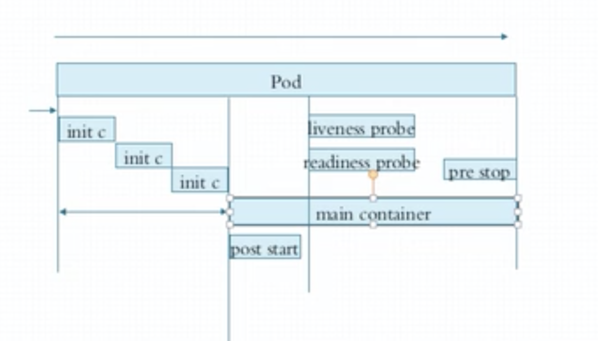

#k8s pods 控制器进阶

#### 1. Pops 资源

   - sec.containers
    
        - name  < string >
        - image < string > 
        - imagePullPolicy < string >  枚举
            -  Always（总是拖image） Never（永远不拖） IfNotPresent （不存在，去拖。但不包括laster 版本）
        - ports < []obj > 暴露端口 （仅仅是额外信息，不能正在爆露，真的在容器中）

        - command 类似 dockerfile entryPoint  如果没有，这默认执行dockerfile 中的 entryPoint
        - args  给command 传参 类似乎 dockerfile cmd 如果 yaml 配置 没有 command 则参数传给 dockerfile  的 entryPoint 然后dockerFile中 cmd 被 忽略  
        - evn  evnFrom

#### 2. 标签  标签选择器
    

   - labels：map < string >
    key : value  字母，数字，_, -, .  63个字符，只能字母，数字开头
   - 标签选择器
       
            // 查看 pods 所有标签
            kubectl get pods --show-labels 
            
            // 查看所有 pods 下 app 的标签值
            kubectl get pods -L app[label名称], app1[label名称], app2[label名称]
          
            // 查看所有 pods 下 拥有 app 标签的 pod
            kubectl get pods -l app[label名称] [--show-labels 选项 查看下面的label]
           
            // 给资源标签打标
            kubectl label pods pod-demo[pod名称] key=value 【--orver-writer 如果修改】
            
            //  =值标签选择器   = == !=
            kubectl get pods -L app=xxx[label名称=value], app1=xxx1[label名称=value]
              
            // 集合方式的选择器 KEY in, KEY notin, !KEY, KEY
            kubectl get pods -L "app in (x1, x2)" 
           
           
   - 许多资源支持内嵌字段 定义的标签选择器
   
        - matchLabels： 直接给定健值选择
        
        - matchExpressions： 基于给定的表达式来选择 {key: "KEY", operate:"OPERATE", "VALUE": [VAL1, VAL2]}
            操作符：
            in， notIn 为非空列表
            exists， notExists values 必须为空列表
                
            
   - nodeSelector < map[string][string]>  节点标签选择器
        yaml 配置中，可以定义
        
   - nodeName < string > 直接指定选择在哪个node上
   
   - annotations 
    
        - 合labels 的区别， 不能用于挑选资源，仅对资源做"元数据" （健，值 不受限制）
        
        - 大型项目 来表明元数据
        
        - 查看 describe nodes name
        
   
   
   - pod 生命周期
   
        - 状态 
            - pending（挂起，已经创建，但是没有适合运行的节点）
            - running 运行
            - failed 失败 
            - successed 成功 （pod 运行很短）
            - unknown (节点上 kubelet 故障)
        
        - 创建Pod：
           
           - apiServer 接收请求
           
           - scheduler 调度节点
           
           - kubelet 拿到创建清单
           
        - 初始化容器
        
            - init container 穿行初始化容器
            
            - main container 主程序
            
            - post start 提供启动前，需要的操作 (先执行 docker entryPoint 在执行postStart)
            
            - pre stop 提供关闭前，需要的操作
            
            - liveness probe 主进程存活状态检测（容器探测）
            
            - readness probe 主进程就绪状态检测（容器探测）
            
        
        
        - 容器重启策略
        
            - restartPolicy ：Always（总是）， OnFailure（只有状态为错误，非正常结束）， Never（永不重启）（默认 Always）
            
            - 第一次立刻重启, 后面重启延迟
            
            - 除非node 被删，pod 永远在 一个node 上重启
            
        - pod 终止过程（k8s中主要单位）
        
            - 平滑终止 对pod 内容器 广播 中止信号（15），并给一个宽限期（默认30秒）， 30秒后，发送kill 信号
           
        - 容器探测（三种探针类型） 
        
                // 查看格式 
                kubectl describe pods.spec.containers.livenessProbe
            
            - execAction
            
            - tcpSocketAction
            
            - HTTPGetAction
            
        
