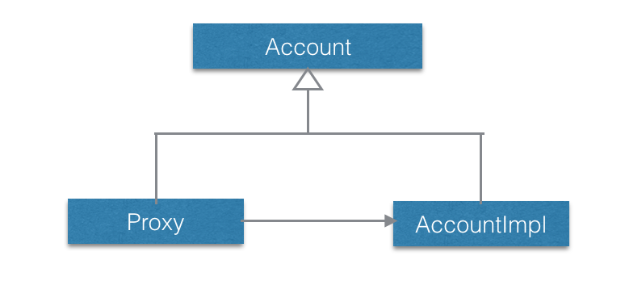

#Golang拦截器的一种实现
##前言

说起拦截器，大家一定会想起Java语言。
Java里的拦截器是动态拦截Action调用的对象，它提供了一种机制使开发者可以定义在一个action执行的前后执行的代码，也可以在一个action执行前阻止其执行，同时也提供了一种可以提取action中可重用部分的方式。在AOP（Aspect-Oriented Programming）中拦截器用于在某个方法或字段被访问之前，进行拦截然后在之前或之后加入某些操作。

最近一段时间，笔者想在Golang代码里面使用拦截器，但在github上却没有找到相关的库，于是就有了自己实现一个拦截器的想法。
Golang没有虚拟机，对反射的支持比Java弱很多，所以不能照搬java的实现方式。就在笔者决定彻底放弃使用动态代理实现拦截器时，突然来了灵感，并且一口气完成了实现。

本文结合代码介绍Golang拦截器的一种实现，希望能给现在或将来想用拦截器的Gopher一些思路。

##产品代码

我们简单模拟一下产品代码：

有一个Account接口，声明了方法Query和Update，分别用于查询帐户和更新帐户
类AccountImpl实现了Account接口
有一个简单工厂New，用于创建一个Account对象
代码如下所示：

```go
package account

import (
    "fmt"
)

type Account interface {
    Query(id string) int
    Update(id string, value int)
}

type AccountImpl struct {
    Id string
    Name string
    Value int
}

func (a *AccountImpl) Query(_ string) int {
    fmt.Println("AccountImpl.Query")
    return 100
}

func (a *AccountImpl) Update(_ string, _ int) {
    fmt.Println("AccountImpl.Update")
}

var New = func(id, name string, value int) Account {
    return &AccountImpl{id, name, value}
}
```

我们写一个main函数：

```go
package main

import (
    "interceptor/account"
)

func main() {
    id := "100111"
    a := account.New(id, "ZhangSan", 100)
    a.Query(id)
    a.Update(id, 500)
}

```

运行程序：

```cmd
$ go run main.go
AccountImpl.Query
AccountImpl.Update
```

## 静态代理

静态代理的类图很简单，如下所示：



我们在产品代码之外实现一下Proxy，如下所示：

```go
package proxy

import (
    "interceptor/account"
    "fmt"
)

type Proxy struct {
    Account account.Account
}


func (p *Proxy) Query(id string) int {
    fmt.Println("Proxy.Query begin")
    value := p.Account.Query(id)
    fmt.Println("Proxy.Query end")
    return value
}

func (p *Proxy) Update(id string, value int) {
    fmt.Println("Proxy.Update begin")
    p.Account.Update(id, value)
    fmt.Println("Proxy.Update end")
}
```

Account对象跳转到Proxy

```go
package main

import (
    "interceptor/account"
    "interceptor/proxy"
)

func main() {
    id := "100111"
    a := account.New(id, "ZhangSan", 100)
    a.Query(id)
    a.Update(id, 500)
}

func init() {
    account.New = func(id, name string, value int) account.Account {
        a := &account.AccountImpl{id, name, value}
        p := &proxy.Proxy{a}
        return p
    }
}
```

运行程序：

```cmd
$ go run main.go
Proxy.Query begin
AccountImpl.Query
Proxy.Query end
Proxy.Update begin
AccountImpl.Update
Proxy.Update end
```

OK！完全符合期望，而且拦截器对产品代码基本无侵入，仅需在main包的init函数中重定义简单工厂函数变量。

##小结
本文结合代码给出了Golang拦截器的一种实现，即“静态代理模式 ＋ 简单工厂函数变量”。读者掌握拦截器的实现技巧后，可以基本无侵入的实现微服务的trace功能。

说明：对于不满足本方法约束的框架，比如Beego，一般需要借助框架自身的filter功能实现对其入口出口消息的拦截。