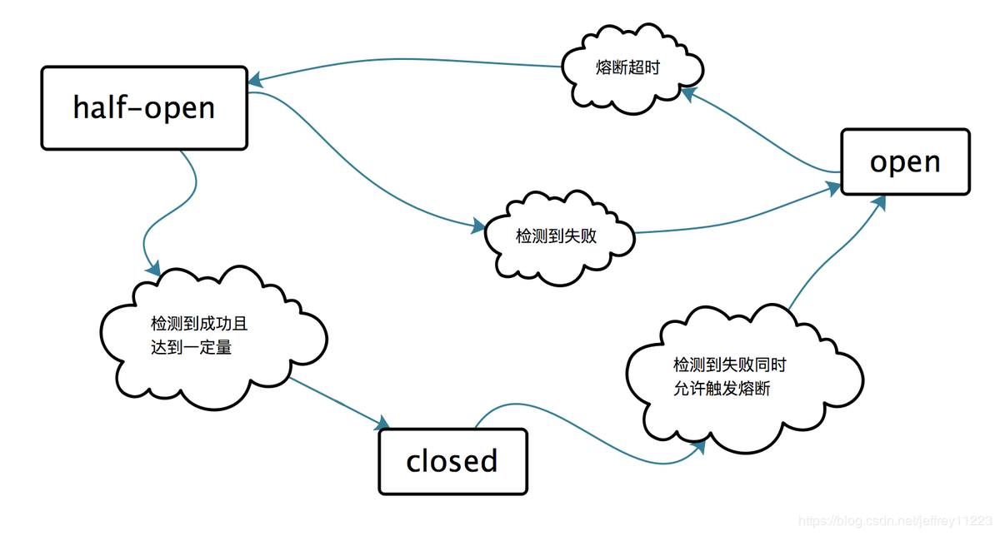

#简单熔断器实现

###breaker状态机



###状态转换逻辑

初始为closed状态，一旦遇到请求失败时，会触发熔断检测（见下方的 ShouldTrip），熔断检测来决定是否将状态从closed转为open。

当熔断器为open状态时，会熔断所有当前服务要发出去的请求，直到冷却时间（见下方的CoolingTimeout）结束，会从open转变为half-open状态。

当熔断器为half-open状态时，以检测时间（见下方的 DetectTimeout）为周期去发送请求。请求成功则计数器加1，当计数器达到一定阈值时则转为closed状态；请求失败则转为open状态。

熔断器内部数据结构

```go

type Breaker struct {
	Container // contains all success, error and timeout
	sync.RWMutex

	state           State
	openTime        time.Time // the time when the breaker become OPEN
	lastRetryTime   time.Time // last retry time when in HALFOPEN state
	halfopenSuccess int       // consecutive successes when HALFOPEN

	options Options

	now func() time.Time
}
```

Breaker是暴露在最外层的struct，由以下属性组成：

- Container：是一个interface，被 window 实现，负责熔断器请求失败，成功的相关计算和统计

- RW锁：在http-gateway中，针对每个cmd有一个熔断器，每个 cmd 同时会有多个goroutine并发请求，需要RW锁来保持熔断器中计数器，状态等等的同步

- state：熔断器三种状态，closed，open 和 half-open

- openTime：当熔断器变为 open 状态时，记录下的时间

- lastRetryTime：在 half-open 状态时，会有个检测周期，即每隔这个周期之后，熔断器会放请求出去，同时更新这个 lastRetryTime。

- halfopenSuccess：在 half-open状态时，当请求成功时，halfopenSuccess 会+1，当 halfopenSuccess 等于一个阈值时（默认为2），则变为 closed 状态

- options：Breaker 的配置项，包括桶持有数量持有时间，冷却时间，检测周期，熔断检测回调和状态变化回调等等

```go
type window struct {
	sync.Mutex
	oldest  int       // oldest bucket index
	latest  int       // latest bucket index
	buckets []*bucket // buckets this window has

	bucketTime time.Duration // time each bucket holds
	bucketNums int           // the largest number of buckets of window could have
	expireTime time.Duration // expire time of this window, equals to window size
	inWindow   int           // the number of buckets in the window currently

	conseErr int64 //consecutive errors
}
``` 

window负责熔断器请求失败，成功的相关计算和统计，有以下属性组成：

- 互斥锁：保证内部数据同步

- oldest：最老的桶，由 latest 桶变化而来，用于窗口下所有请求结果的存储

- latest：最新的桶，每次统计请求结果时，用最新的桶来存储

- buckets：所有桶

- bucketTime：latest 桶的在线时间，一旦 latest 桶下线，则变为 oldest 桶

- bucketNums：窗口最大持有桶的数量

- expireTime：oldest 桶的过期时间，一旦 oldest 桶过期，则从 window 中“移去”，expireTime = bucketTime*bucketNums

- inWindow：窗口当下持有桶的数量

- conseErr：连续错误数量，每次请求结果为成功时便清零

熔断检测回调：

- ThresholdTripFunc：当失败和超时的总数超过阈值，则熔断

- ConsecutiveTripFunc：当连续错误总数（conseErr）超过阈值，则熔断

- RateTripFunc：当窗口内请求总数大于最小采样数且错误率（失败+超时数量/请求总数）大于一定值时，则熔断

api

- InitCircuitBreakers方法作为初始化熔断器使用，这里用cmd来区分各个breaker

- BreakerWhitelist 可以配置熔断白名单，在白名单中的cmd不参与熔断

- IsTriggerBreaker 判断当前cmd的熔断器的状态，并告诉上层

- api比较简单，可以直接阅读源码来决定如何使用，仓库地址见文首
