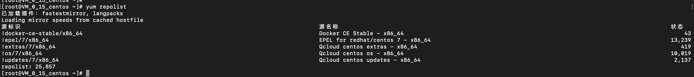
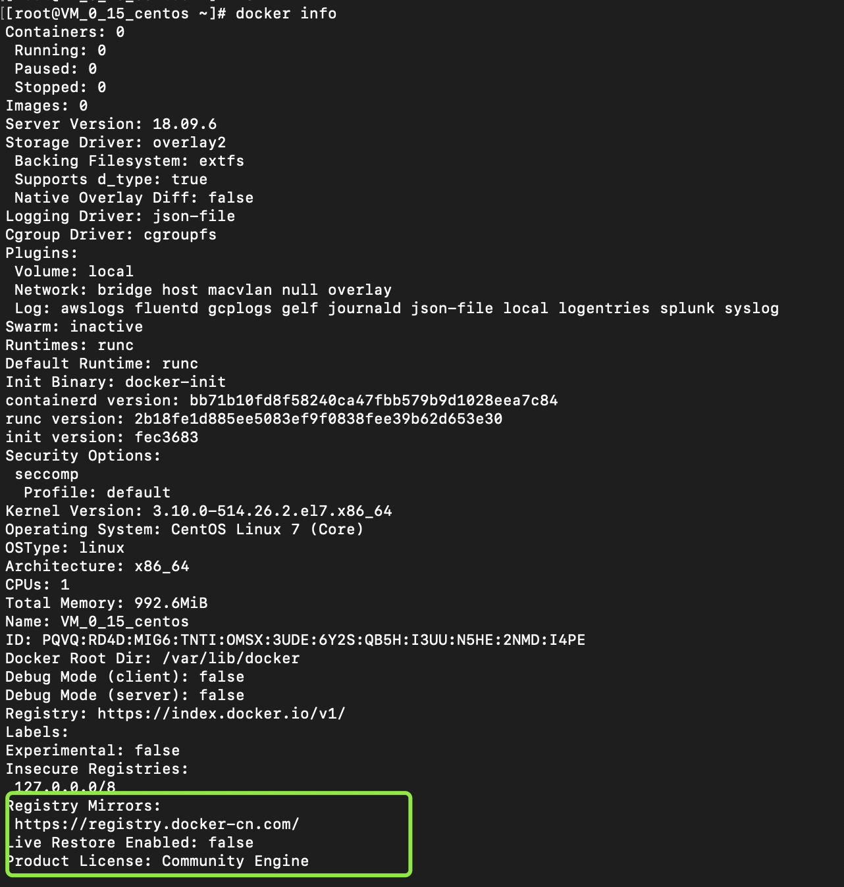

# docker安装 配置

### linux centOs7 使用 yum 安装 docker
####1.使用国内源（目前使用清华源）

下载源 docker_ce

    cd /etc/yum.repos.d/

    wget https://mirrors.tuna.tsinghua.edu.cn/docker-ce/linux/centos/docker-ce.repo

替换源

    vim /etc/yum.repos.d/docker-ce.repo
    
    :@https://download.docker.com/@https://mirrors.tuna.tsinghua.edu.cn/docker-ce/@

查看 yum 源是否生效

    yum repolist

####2.安装 docker （docker-ce）

yum install docker-ce

启动 docker

    systemctl start docker.service

yum 安装结束 使用 docker info|docker version

####3. docker 加速 （被墙，你懂的）

docker 配置目录： /etc/docker/daemon.json(注意：/etc/docker/ 需要自己建目录)

使用国内源：

docker cn: https://registry.docker-cn.com/
 
中科大: https://docker.mirrors.ustc.edu.cn/

...
    
    // daemon.json 文件
    {
    	"registry-mirrors":["https://registry.docker-cn.com/"]
    }

重启docker
    
      systemctl restart docker.service
      
查看配置生效
      
      docker info
      

